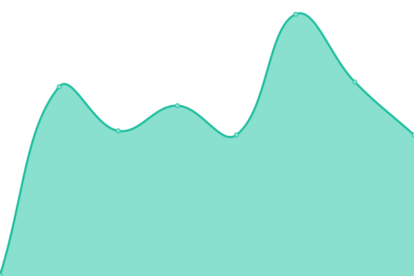
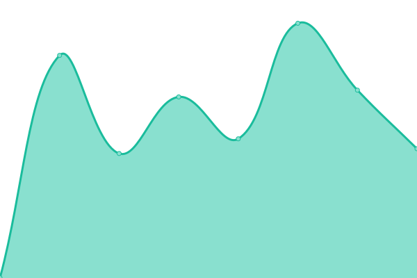
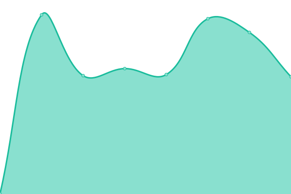

# [📈 Live Status](https://upptime.github.io/upptime): <!--live status--> **🟩 All systems operational**

This repository contains the open-source uptime monitor and status page for [Upptime](https://upptime.js.org), powered by [Upptime](https://github.com/upptime/upptime).

With [Upptime](https://upptime.js.org), you can get your own unlimited and free uptime monitor and status page, powered entirely by a GitHub repository. We use [Issues](https://github.com/upptime/upptime/issues) as incident reports, [Actions](https://github.com/mamine3004/upptimerMetrics/actions) as uptime monitors, and [Pages](https://upptime.github.io/upptime) for the status page.

<!--start: status pages-->
<!-- This summary is generated by Upptime (https://github.com/upptime/upptime) -->
<!-- Do not edit this manually, your changes will be overwritten -->
<!-- prettier-ignore -->
| URL | Status | History | Response Time | Uptime |
| --- | ------ | ------- | ------------- | ------ |
|  Tools | 🟩 Up | [tools.yml](https://github.com/mamine3004/upptimerMetrics/commits/HEAD/history/tools.yml) | 

 243ms
     
 | 

<a href="https://mamine3004.github.io/upptimerMetrics/history/tools">100.00%</a>
    

|  PROD | 🟩 Up | [prod.yml](https://github.com/mamine3004/upptimerMetrics/commits/HEAD/history/prod.yml) | 

 235ms
     
 | 

<a href="https://mamine3004.github.io/upptimerMetrics/history/prod">100.00%</a>
    

|  WEBPANEL | 🟩 Up | [webpanel.yml](https://github.com/mamine3004/upptimerMetrics/commits/HEAD/history/webpanel.yml) | 

 232ms
     
 | 

<a href="https://mamine3004.github.io/upptimerMetrics/history/webpanel">100.00%</a>
    

|  Main Server | 🟩 Up | [main-server.yml](https://github.com/mamine3004/upptimerMetrics/commits/HEAD/history/main-server.yml) | 

 226ms
     
 | 

<a href="https://mamine3004.github.io/upptimerMetrics/history/main-server">100.00%</a>
    

|  [SOMAP](https://somap.itadvisor.ma/) | 🟩 Up | [somap.yml](https://github.com/mamine3004/upptimerMetrics/commits/HEAD/history/somap.yml) | 

 890ms
     
 | 

<a href="https://mamine3004.github.io/upptimerMetrics/history/somap">100.00%</a>
    

|  [Gammaradtech](https://gammaradtech.com/) | 🟩 Up | [gammaradtech.yml](https://github.com/mamine3004/upptimerMetrics/commits/HEAD/history/gammaradtech.yml) | 

 1033ms
     
 | 

<a href="https://mamine3004.github.io/upptimerMetrics/history/gammaradtech">100.00%</a>
    

<!--end: status pages-->

[**Visit our status website →**](https://upptime.github.io/upptime)

## 📄 License

- Powered by: [Upptime](https://github.com/upptime/upptime)
- Code: [MIT](./LICENSE) © [Anand Chowdhary](https://anandchowdhary.com), supported by [Pabio](https://pabio.com)
- Data in the `./history` directory: [Open Database License](https://opendatacommons.org/licenses/odbl/1-0/)
